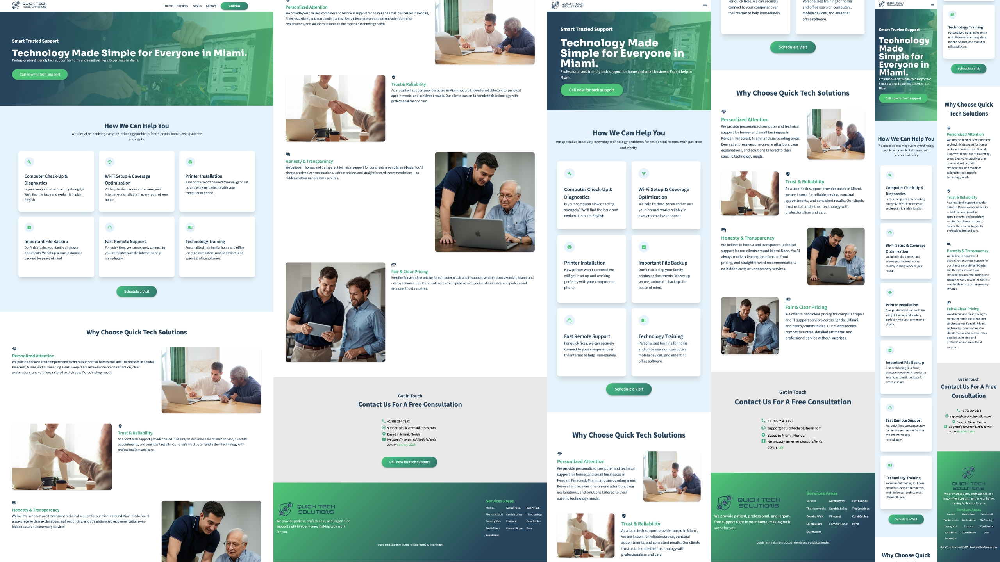

# Quick Tech Solutions Web – Business Website

Professional website built for a local IT support and computer repair business in Miami-Dade.

🔗 Live Site: https://quicktechsolutions.now/

---

## 📌 Overview

This project is a high-performance, SEO-optimized landing page developed with React and Tailwind CSS.

It showcases services including:

- Computer & laptop repair
- Residential & small business IT support
- WiFi and network setup
- Remote tech support
- Computer training for beginners & seniors

The goal was to create a clean, trustworthy, conversion-focused website for a local technology services brand.

---

## 🛠 Tech Stack

- React (Vite)
- Tailwind CSS (custom design system using `@theme`)
- Cloudflare (CDN + optimization)
- SEO optimization (meta tags, Open Graph, structured data JSON-LD)
- Responsive design (mobile-first approach)

---

## ✨ Key Features

- Custom reusable UI components (Logo, Buttons, Layout sections)
- Fully responsive navigation with animated mobile menu
- Gradient-based design system using CSS variables
- Structured data (LocalBusiness schema) for local SEO
- Optimized production build
- Deployed with HTTPS and CDN caching

---

## 📈 Performance & SEO

- Semantic HTML structure
- Custom meta tags & Open Graph integration
- JSON-LD LocalBusiness schema
- Sitemap integration
- Optimized images & minified build
- Cloudflare caching & Brotli compression

---

## 🎯 What This Project Demonstrates

- Ability to design and implement a full business-ready website
- Clean component architecture in React
- Tailwind customization beyond default utility usage
- Understanding of SEO fundamentals for local businesses
- Deployment & production optimization workflow

---
